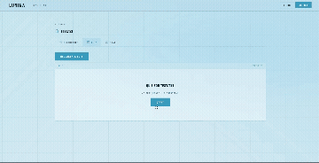
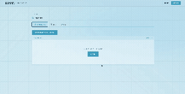

# Lumina

Lumina is an AI-powered study companion that helps users learn from their own documents.

## Preview

### AI Chat


Chat with uploaded documents using a locally hosted LLM with real-time streaming.

---

### Quiz Generation



Generate interactive quizzes from study materials.

---

### Flashcards



Review AI-generated flashcards for active recall learning.

Features:
- Upload TXT, MD and PDF files
- AI-generated flashcards
- AI-generated quizzes
- Chat with your documents
- Local AI integration via Ollama
- Real-time response streaming with WebSockets

## Tech Stack

### Frontend
- React + Vite (JavaScript)
- React Router
- SignalR client (`@microsoft/signalr`)

### Backend
- ASP.NET Core Web API (.NET 10)
- Entity Framework Core
- SQLite
- JWT auth (access token + rotating refresh token)
- SignalR

### AI
- Ollama
- Qwen 3 (`qwen3:4b`)

## Setup

### Prerequisites
- [.NET 10 SDK](https://dotnet.microsoft.com/download)
- [Node.js](https://nodejs.org/) (18+) and npm
- [Ollama](https://ollama.com) running locally

### 1. Install Ollama and pull the model

The AI features call a local Ollama instance at `http://localhost:11434`, so Ollama
must be installed and running before you start the backend.

```bash
# macOS (Homebrew)
brew install ollama

# Linux
curl -fsSL https://ollama.com/install.sh | sh
```

On Windows, download the installer from [ollama.com/download](https://ollama.com/download).

Then start the server and pull the model Lumina uses:

```bash
ollama serve          # leave this running (not needed if installed as a service)
ollama pull qwen3:4b
```

### 2. Configure the backend `.env`

The JWT signing key is **not** stored in `appsettings.json`. It is read from a
`.env` file at the backend solution root (`backend/Lumina/.env`, gitignored), loaded
into environment variables at startup by `DotNetEnv`.

Copy the example and set a real key:

```bash
cd backend/Lumina
cp .env.example .env
```

Then edit `.env` and set `Jwt__Key` to a strong random secret of **at least 32 characters**:

```bash
# generates a suitable value
openssl rand -base64 48
```

```dotenv
Jwt__Key="your-generated-secret-here"
```

Startup throws a clear error if the key is missing or too short. The non-secret JWT
settings (issuer, audience, token lifetimes) live in `appsettings.json`.

### 3. Run the backend

From `backend/Lumina`:

```bash
# apply migrations (creates lumina.db)
dotnet ef database update --project Lumina/Lumina.csproj

# run the API
dotnet run --project Lumina/Lumina.csproj
```

The API listens on `http://localhost:5131`.

### 4. Run the frontend

From `frontend`:

```bash
npm install
npm run dev
```

The app runs on `http://localhost:5173` and proxies `/api` and `/ws` requests to the
backend, so make sure the backend (and Ollama) are running too.

## Status

🚧 Work in progress
